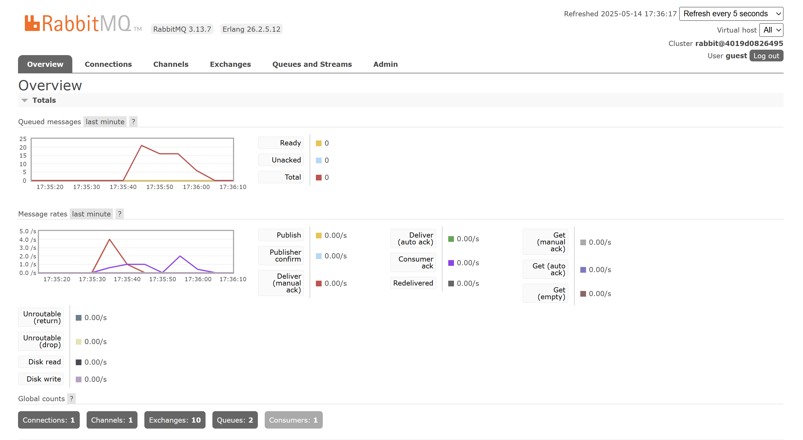
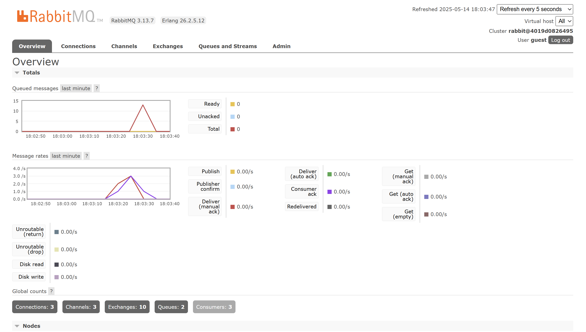

# Kayla Soraya Djakaria - 2306256381

1. What is amqp?

    `amqp` is a protocol for message-oriented middleware that allows communication between different applications or services.

2. What does it mean? guest:guest@localhost:5672 , what is the first guest, and what is the second guest, and what is localhost:5672 is for? 

    `guest:guest@localhost:5672` is a connection string for connecting to an amqp broker. The first `guest` is the username, the second `guest` is the password, and `localhost:5672` is the address and port of the broker.

### Simulation slow subscriber

The total number of messages in queue is 21. It is because the publisher sends messages at a faster rate than the subscriber can consume them, causing the messages to accumulate in the queue.

### Reflection and Running at least three subscribers

The queue spiked to 13 messages for a moment before emptying out almost immediately. Because the publisher pushed several messages at once and I had three subscribers processing them concurrently, the backlog cleared much faster than with just one subscriber. This illustrates how adding more consumers can increase throughput and prevent queue build-up when the publisher is operating quickly.

